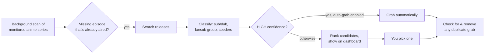

<p align="center">
  
</p>

<p align="center">
  
  
  
  
  
</p>

Nyaarr is a self-hosted companion for Sonarr + Radarr that handles the parts of anime library management they're genuinely bad at:

- 🎙️ **Sub vs. dub, made explicit.** Set a preference (globally or per-show) instead of hoping a release title happens to mention it.
- 🔍 **Honest about what it doesn't know.** Release titles don't always say whether subs are included — Nyaarr classifies what it can (HIGH confidence), flags what it can't (UNKNOWN), and never silently guesses on the unknowns. Those wait for you to review.
- 🌍 **Knows English subs from other subs.** VOSTFR and French/German/Spanish/Italian/Portuguese-subbed releases are tagged `foreign_sub` and never satisfy a "prefer sub" (English) preference, and a bare "Subbed" with no language is treated as unknown rather than assumed English.
- 🆕 **New episodes first.** By default only episodes that aired in the last 7 days are searched, newest first across the whole library, so a big backlog doesn't hammer your indexers.
- 🧹 **No more duplicate grabs.** Sonarr/Radarr's own automatic search can land a second copy right alongside a curated pick — Nyaarr checks and cleans that up after every grab.
- 📅 **Air-date aware.** Distinguishes "hasn't aired yet" from "aired but nothing's out there" — two very different problems that look identical in Sonarr's own missing list.
- 🎬 **Finds the movies too.** Anime franchises often span a TV series and separate theatrical movies — Nyaarr can search for a series' related movies and let you confirm which ones are real before adding them to Radarr.

Nyaarr never touches a media file directly — it only ever searches, grabs, and dedupes through Sonarr/Radarr's own APIs, the same way you would by hand.

## How it works



**The core safety rule:** UNKNOWN-confidence releases are never auto-grabbed, no matter what. Auto-grab only ever applies to HIGH-confidence matches, and it's off by default.

## Quick start

**You'll need:** Docker + Docker Compose, a running Sonarr instance, and a running Radarr instance you have admin access to.

No need to clone or build anything: a ready-made image is published for amd64 and arm64 (Raspberry Pi 4/5 on a 64-bit OS).

```bash
mkdir nyaarr && cd nyaarr
curl -fsSLO https://raw.githubusercontent.com/spongebobmoviept-lab/Nyaarr/main/docker-compose.yml
curl -fsSL -o .env.example https://raw.githubusercontent.com/spongebobmoviept-lab/Nyaarr/main/.env.example
cp .env.example .env                        # optional overrides; the defaults work as-is
mkdir -p data && sudo chown 1000:1000 data  # container runs as a non-root user; a freshly-created bind mount defaults to root
docker compose up -d                        # pulls ghcr.io/spongebobmoviept-lab/nyaarr
```

To build from source instead, clone the repo, uncomment `build:` in `docker-compose.yml`, and run `docker compose up -d --build`.

Open `http://<this-machine's-ip>:8686` and follow the setup wizard:

1. Create your login (username + password)
2. Connect Sonarr — tests the connection live
3. Connect Radarr — tests the connection live and lets you pick a default quality profile/root folder for franchise movie adds
4. Optionally connect TMDB (only needed for movie discovery) and/or a Discord webhook for notifications

That's it — everything can be changed later from the in-app Settings page.

`DRY_RUN=true` by default (see `.env.example`) — Nyaarr will log what it *would* grab or remove without actually doing it, until you've reviewed a few sessions and trust its picks.

## What it looks like

The dashboard lists every anime series with its curation status, a "Needs Review" queue of ranked release candidates for you to pick from, and a Settings page for every tunable knob below. No screenshots here on purpose — this repo ships with zero real library data or credentials baked in, so there's nothing to show until it's pointed at *your* server.

## Configuration reference

Everything below is set through the setup wizard or the in-app Settings page — you shouldn't need to hand-edit config files. For reference, here's what's tunable:

| Setting | Default | What it does |
|---|---|---|
| Anime tag name | `anime` | Fallback signal for shows tagged manually instead of detected via Sonarr's own `seriesType` |
| Minimum seeders | 1 | Hard filter — a release below this is never picked, no matter how good it otherwise looks |
| Known fansub groups | SubsPlease, Erai-raws, ASW, EMBER, ToonsHub, NanDesuKa | Groups trusted as a HIGH-confidence sub signal even without an explicit "Multi-Subs"-style marker in the title |
| Default language preference | Prefer sub | Global default; overridable per-show |
| Scan interval | 45 minutes | How often the background scan runs |
| Max episodes per scan | 50 | Caps how many missing episodes get a fresh live search per cycle, so a large library stays cheap to scan |
| New episodes only (days) | 7 | Only episodes that aired within this many days are searched, newest-aired first across the whole library. Set `0` to work through the entire missing backlog. Env: `NEW_EPISODES_ONLY_DAYS` |
| Block Opus audio | Off | When on, releases whose title marks Opus audio (e.g. `[Opus]`, `Opus 2.0`) are never picked, even as the only option. Turn it on if one of your players can't play Opus (no sound, or a forced transcode). Env: `BLOCK_OPUS_AUDIO` |
| Auto-grab HIGH confidence | Off | When on, HIGH-confidence releases grab automatically instead of waiting for review — UNKNOWN ones never do, regardless |
| Movie min runtime | 40 minutes | Franchise movie discovery noise filter |
| Movie min vote count | 20 | Franchise movie discovery noise filter |
| Default movie quality profile / root folder | — | Where a confirmed franchise movie gets added in Radarr |

## FAQ

**Will this grab things I don't want?**
Not silently. Anything Nyaarr isn't confident about (UNKNOWN classification) always waits for you to review and pick manually — auto-grab, when enabled, only ever applies to HIGH-confidence matches.

**Does it transcode or touch video files itself?**
No — it only ever searches, grabs, and dedupes through Sonarr/Radarr's own APIs, exactly like a person clicking around in their UIs would.

**Can I run this without TMDB or Discord?**
Yes, both are entirely optional. Skip them in the wizard and add them later from Settings if you change your mind.

**What counts as "anime" for Nyaarr's purposes?**
Sonarr's own `seriesType` field is the primary signal; a configurable tag name is the fallback for shows tagged manually instead.

## Troubleshooting

- **The container won't start / crashes immediately.** Check `docker compose logs -f nyaarr` — the most common cause is the `data/` bind mount being owned by root instead of the container's non-root user (see the `chown` step above).
- **The wizard's "Test Connection" fails for Sonarr or Radarr.** Double check the URL includes `http://` and the correct port, and that it's reachable *from inside the container* — `localhost` almost never works here, use the machine's real LAN IP.
- **A grab failed and Nyaarr moved on to a different release.** That's intended: a release that fails to grab (for example because the same torrent is already in your download client's queue) is recorded as tried and isn't retried forever; the next scan picks the next-best candidate. One failing episode doesn't stop the rest of the scan.
- **Nothing seems to be happening.** Check the in-app Log tab first — every decision (including *why* a release was skipped) is logged there.
- **Found a bug or want a feature?** Open an issue on this repo.

## Design principles

- One Python process, one container, no database, no build step.
- Never auto-grabs anything it isn't confident about.
- Everything Nyaarr does is visible: the dashboard and Log tab exist specifically so this never feels like a black box.

## Security notes

- **Keep it on your LAN, not the open internet.** The web UI uses HTTP Basic auth with a per-IP lockout after 10 failed attempts. Basic auth over plain HTTP sends the password in the clear, so for remote access put Nyaarr behind a reverse proxy with HTTPS, or a VPN.
- **First-run setup is open until you finish it.** Until an admin login exists, anyone who can reach port 8686 can create it. Complete the wizard right after first start.
- **Secrets stay in `data/`.** API keys and your hashed admin login live in the `data/` volume, never in the image. `.env` is git-ignored; only `.env.example` is tracked. API keys and Discord webhook tokens are redacted from log lines.
- **Release titles are untrusted input.** Titles from indexers and TMDB are HTML-escaped before the dashboard shows them.
- The container runs as a non-root user (uid 1000).

## Changelog

**1.1.0**
- New `foreign_sub` classification: VOSTFR and French/German/Spanish/Italian/Portuguese subs are recognised and never count as English subs; a bare "sub"/"subbed" is treated as unknown instead of assumed English.
- New setting **Block Opus audio** (`BLOCK_OPUS_AUDIO`, off by default).
- New setting **New episodes only (days)** (`NEW_EPISODES_ONLY_DAYS`, default 7; `0` = whole backlog). Scans now go newest-aired first across the whole library.
- Failed grabs are recorded as tried, so the same broken release isn't retried every cycle.
- Sonarr and Radarr queues are read in full (paginated) instead of only the first 200 entries, so duplicate cleanup sees everything.
- Grab notifications include the series/movie poster.
- One episode's search or grab error no longer aborts the rest of a scan.
- Sonarr request timeout raised from 30 s to 120 s for large libraries.
- Security: the dashboard HTML-escapes third-party text; Discord webhook tokens are redacted from logs.
- `.env` is now `.env.example` (copy it to `.env`); `.env` is git-ignored. Docker base image pinned to a specific Python patch release.

**1.0.0**: first public release.

## License

MIT, see [LICENSE](LICENSE).
